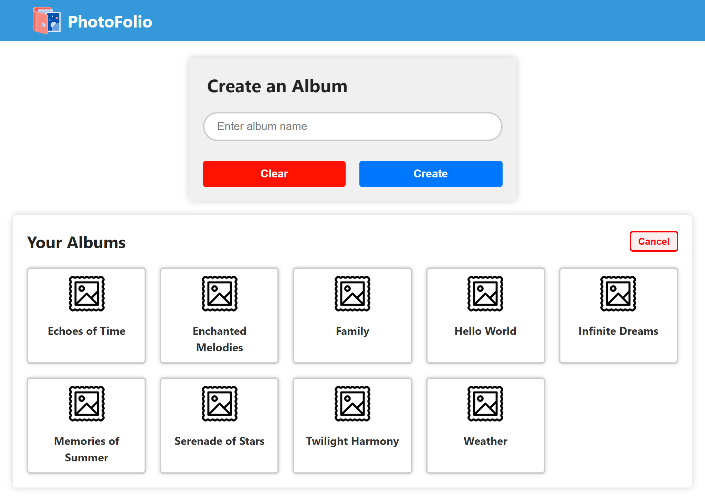
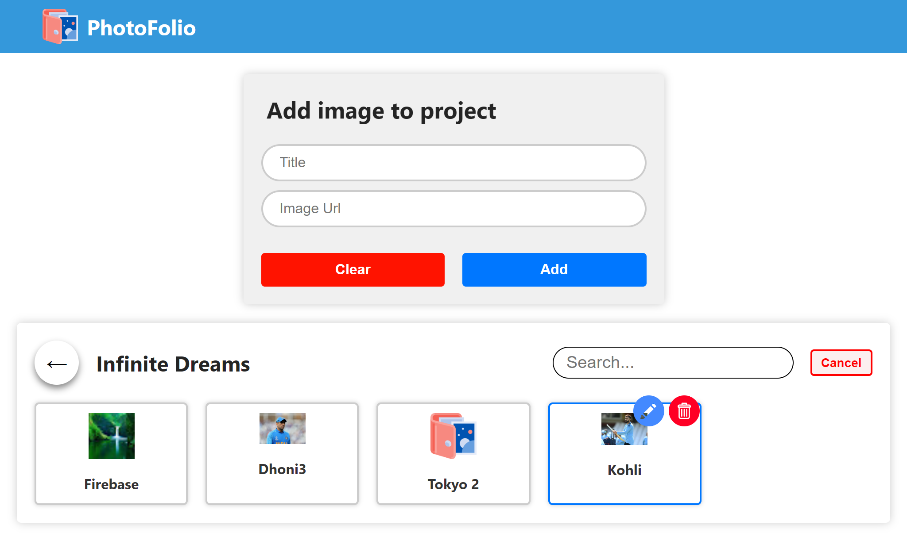
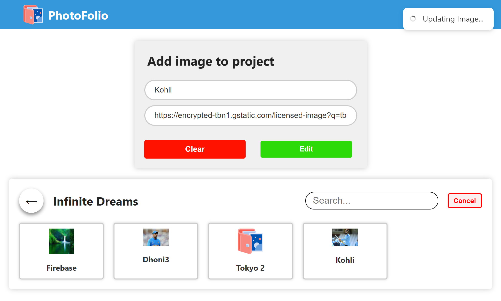
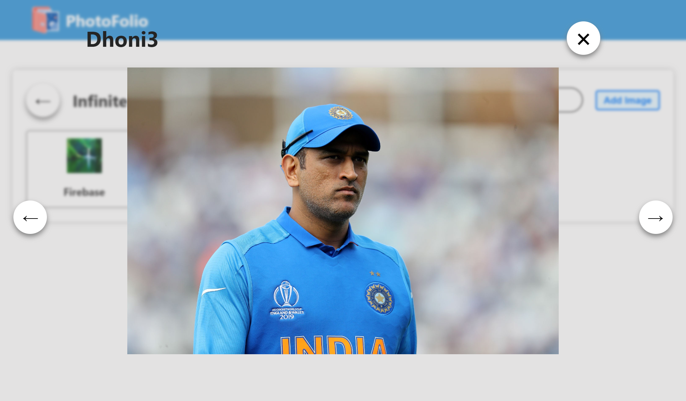

# PhotoFolio

PhotoFolio is a web-based photo album management application that allows users to create, organize, and view photo albums. It provides a user-friendly interface for adding, editing, and deleting images within albums.

## Screenshots

## Features

- Create and manage multiple photo albums.
- Add images to albums with titles and URLs.
- View images in a slideshow-style carousel.
- Edit image information (title and URL).
- Delete images from albums.
- Search for images within albums.

## Technologies Used

- **Frontend:**

  - React.js: Frontend JavaScript library for building user interfaces.
  - HTML/CSS: Markup and styling of web pages.
  - Firebase Hosting: For hosting the frontend application.

- **Backend:**
  - Firebase Firestore: Cloud NoSQL database for storing albums and images.

## Installation

1. Clone the repository:

2. Install dependencies:

3. Create a Firebase project:

- Go to the [Firebase Console](https://console.firebase.google.com/).
- Create a new project.
- Set up Firestore, Authentication, and Storage in the Firebase project.

4. Configure Firebase:

- Create a Firebase config file (`src/firebaseConfig.js`) with your Firebase project credentials.

5. Start the development server:

6. Open the app in your browser at `http://localhost:3000`.

## Usage

- Create new albums and add images to them.
- Edit or delete images as needed.
- View images in the carousel and search for specific images.

## Contributing

Contributions are welcome! If you'd like to contribute to the project, please follow these steps:

1. Fork the project.
2. Create a new branch for your feature or bug fix.
3. Make your changes and test them.
4. Commit your changes and push them to your fork.
5. Create a pull request to the main repository.

## License

This project is licensed under the [MIT License](LICENSE).

## Acknowledgments

- Thanks to [Firebase](https://firebase.google.com/) for providing the backend services.

## Contact

- Hashib Raja
- Email: hashibraja23@gmail.com
- LinkedIn: [Your LinkedIn Profile](https://www.linkedin.com/in/hashib-raja-308059219/)
- GitHub: [Your GitHub Profile](https://github.com/hashib786)
